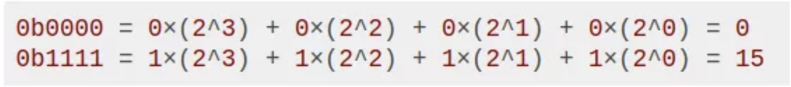
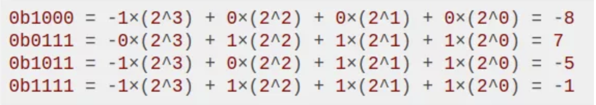

# 整型溢出

数学上一个数的平方当然大于等于 0，但对于大多数编程语言，当 46341 <= int x <= 65535 时，x 的平方结果会是负数 。

其实出现这种情况的原因是「整型溢出」，这篇文章带大家深入理解计算机对数字的表示和计算方式，弄明白「整型溢出」的原因，为什么会出现这么诡异的行为。

LeetCode 上有不少算法题涉及处理整型溢出的细节，在文章的最后会列举一些常见的避免整型溢出的方法。

## 一、基础知识

首先明确一下位（bit，音译比特）和字节（byte）到底是什么。

它们类似米、厘米，都是大小单位。一个「位」即一个二进制位，就是一个 0 或者 1 。一个「字节」的大小是 8 个「位」，即 1 byte = 8 bit。

拿 C/C++ 为例，大部分基础数据类型的大小是固定的，比如 char 类型大小为 1 byte 即 8 bit，int 类型大小为 4 byte 即 32 bit，本文主要以 int 为例进行探讨。

既然一个 int 类型由 32 个二进制位组成，那么它表示数字的大小一定有上限和下限，刚才计算出的奇怪结果就和 int 的编码方式有关。

## 二、补码编码

首先进行约定，我们以 0b 开头代表二进制数，并且假设一个 int 类型的大小只有 4 bit 即 4 个二进制位，而不是 32 bit，以方便说明其原理。

那么，int 类型的数据可取值的范围就是 0b0000 到 0b1111，转化成十进制，也就是从 0 到 15。



但问题是，int 类型是有符号整数，也要表示负数啊，按上面这种直接转换成十进制的方法，没办法表示负数。事实上，上面的编码方式是 unsigned int 无符号整数类型使用的。

为了让 int 能够表示负数，常用的编码方式叫做「补码编码」，把二进制的最高位作为符号位，即最高位系数要加一个负号。很简单，举几个例子你就明白了。



通过上面的例子，你应该能理解这种编码方式了，这种编码方式能够表示的最大正数 int_max = 0b0111 = 7，最小负数 int_min = 0b1000 = -8，所以 int 类型能够表示从 -8 到 7 的有符号整数。

细心的读者可能发现，这种编码方式「不对称」，按道理最大正数和最小负数的绝对值应该相等才对，否则如果对 int_min 取相反数会怎么样，没有正数可以表示出来呀？

其实，这确实是个问题，C 语言的处理方式是，-int_min 仍然等于 int_min，所以说负数的相反数不一定是正数哦，int_min 是唯一一个特例。

现在你理解了「补码编码」，掌握了计算机表示整数的方式，你也就很容易理解所谓的「整型溢出」是什么，为什么有时候两个正数相加突然变成了负数：

试想 int_max + 1 是多少？ `0b0111 + 1 = 0b1000 = -8` 。也就是说，「整型溢出」就是正数的增加超过了 int_max，导致符号位进位变为 1，变成了一个负数。

## 三、乘法运算

类似加法导致「整型溢出」，如果乘法得到的结果如果太大，也会导致溢出，这就是出现正数相乘得到负数的原因。

二进制的乘法跟十进制一模一样的，这里我们讲一种很简单的情况：乘以二的幂。

十进制中，乘以十的幂是最简单的，往后加 0 就行了，比如说 `5 * 100 = 500`，相当于把 5 左移了两位，用 0 填补。同理，二进制中一样的，比如 `0b0011 * 0b0100 = 0b1100`。因为 `0b0100` 就是 2 的二次幂，直接把 `0b0011` 左移两位，用 0 填补即可。

那么，如果乘的不是二的幂，怎么办呢？也很简单，类比十进制，`5 * 99` 怎么计算？小学我们就学过一种巧算方法，把 99 变成 `100 - 1` 进行计算：

```c
5 × 99 = 5 × (100 - 1) = 500 - 5 = 495
```

类似的，二进制也可以使用这种技巧：

```c
  0b0011 × 0b0011
= 0b0011 × (0b0100 - 1)
= 0b1100 - 0b0011
= 0b1001
```

从计算的角度来看，上述过程是完全正确的，但是考虑「补码编码」方式，仍然假设 int 大小为 4 bit，你应该可以看到问题。

```c
0b0011 × 0b0011 = 3 × 3 = 0b1001 = -7
```

这就是题目中说的诡异情况发生的原因。拿 int x = 65535 为例，实际中 int 有 32 个二进制位，65535 的二进制表示是 0b000...111，有 16 个连续的 0 接着 16 个连续的 1。类比上面的例子，通过巧算方法，后 16 位 1 会左移 16 位，导致作为符号位的最高位变成 1，直接导致结果成为负数。

## 四、最后总结

可见，「整型溢出」并不是啥高深的知识，无非是计算结果太大导致符号位发生不正常的改变而已。

如何避免整型溢出呢？最简单的办法就是在适当的地方进行输入数字大小测试，对溢出的风险进行处理，或者将 int 型更换成 long int 或 long long int ，即长整型。因为长整型的大小是 64 bit，虽然也会发生溢出，但是溢出的阈值会大很多，足以应付一般的情况。

还有一个常见的防止溢出的技巧，在二分查找算法中就有用到，我们看一下二分查找算法：

```c
int binarySearch(int[] nums, int val) {
    int lo = 0, hi = nums.length - 1;
    while (lo < hi) {
        // int mid = (lo + hi) / 2;
        int mid = lo + (hi - lo) / 2;
        // ...
    }
}
```

计算 int mid 变量时，为了防止 lo 和 hi 变量数值太大，导致 (lo + hi) 溢出得到负数，我们巧妙地避免了直接相加，仍然得到了相同的结果，这是二分查找算法的一个细节，值得学习。

## 五. Golang 中的 INT_MIN 和 INT_MAX

在C语言中，有标准库limits.h定义了一些最大最小值常量，例如int类型的最大值常量INT_MAX，最小值常量INT_MIN，无符号整型uint类型的最大值常量UINT_MAX

golang的标准库里没有定义这些变量。不过可以用位操作运算，轻松定义这些常量。

```go
const UINT_MIN uint = 0
const UINT_MAX = ^uint(0)

const INT_MAX = int(^uint(0) >> 1)
const INT_MIN = ^INT_MAX
```

## 参考文章

1. 转自：[x * x >= 0 一定成立吗？](https://mp.weixin.qq.com/s?__biz=MzU0MDg5OTYyOQ==&mid=2247483994&idx=1&sn=d9e9bc74b1177e90162d0cb58bb20054&chksm=fb336218cc44eb0e6ac10cfd097c976d11ecfb1f741ca451136a851762632cfde9a09bf4f3d8&scene=21#wechat_redirect) 并增加部分内容
